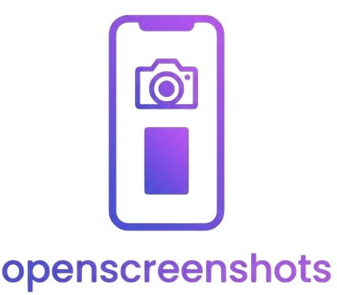
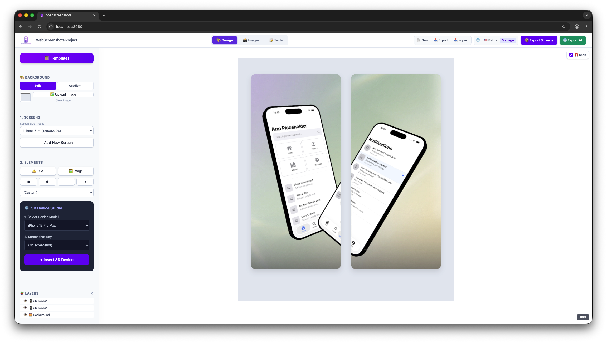
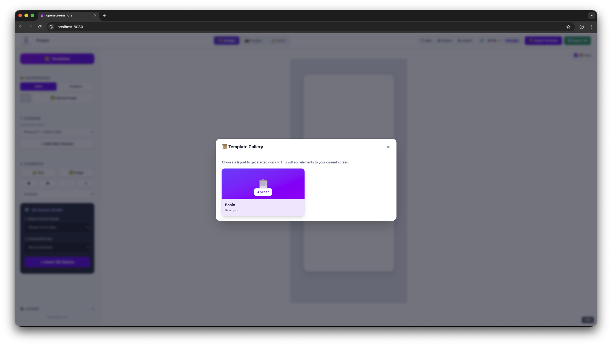
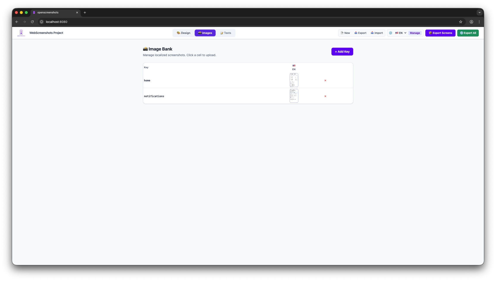
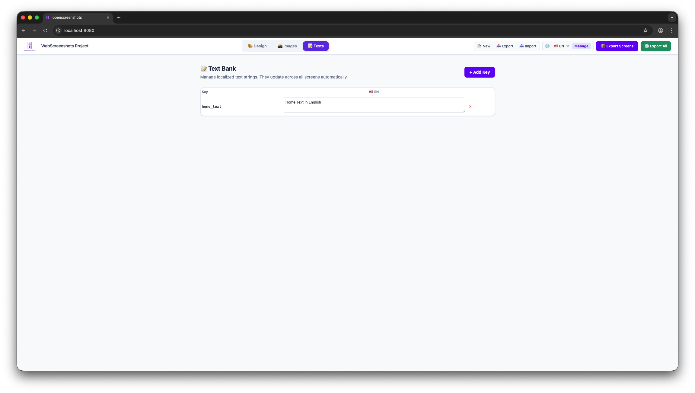
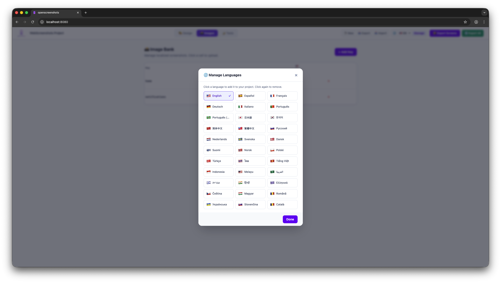

# openscreenshots 📱✨

<p align="center">
  
</p>

> **The Ultimate App Store Screenshot Suite.** Create professional, localized, and stunning mockups for iOS and Android in minutes, powered by standard web technologies.

[](https://threejs.org/)
[](http://fabricjs.com/)
[](https://tailwindcss.com/)
[](https://opensource.org/licenses/MIT)

**openscreenshots** is a powerful, web-based design engine built for independent app developers and studios. It combines a professional 2D canvas with a real-time 3D device renderer, deeply integrated localization tools, and a reliable project export system.

[**Check out the Web Version here**](https://github.com/manurivas1/openscrenshots.git)

---

## 🖼️ Interface Preview

### 3D Device Studio & Design View
<p align="center">
  
</p>

### Template Gallery
<p align="center">
  
</p>

---

## 🌟 Key Features

- **🌐 Global Localization System:** Effortlessly manage different text strings and device screenshots per language. Switch between environments to instantly update the whole canvas.
- **🛡️ Embedded 3D Devices:** Dynamically insert 3D models (iPhone 15 Pro Max, Samsung Galaxy S25 Ultra). Control X/Y/Z rotation, depth order, frame color, and map dynamic localization screenshots straight onto their screens.
- **🎨 Complete Design Tools:** Solid/gradient background composition, layer management interface, text configuration, snap guides, and shape creation out of the box.
- **💾 JSON Project Persistence:** Advanced Import/Export mechanics perfectly store `base64` assets, layers, metadata, and languages safely within a singular downloadable JSON file. 
- **📦 Batch Export (ZIP):** Download all your designed screens simultaneously with a single click, or process *all active languages* into neatly structured ZIP subfolders in seconds.

---

## 📸 Integrated Banks

### Image Bank
Easily replace dynamic placeholder images linked to your 3D models and 2D components.
<p align="center">
  
</p>

### Text Bank
Text keys automatically sync perfectly formatted phrasing throughout your design screens across distinct global target regions.
<p align="center">
  
</p>

### Powerful Language Manager
Integrate over a dozen preconfigured languages to scale your mobile app reach dramatically.
<p align="center">
  
</p>

---

## 🚀 Quick Start

This project requires **no bundlers** or heavy frameworks! It runs directly off raw web standards using dynamic imports.

### 1. Clone the project
```bash
git clone https://github.com/manurivas1/openscrenshots.git
cd openscreenshots
```

### 2. Launch Development Server
Simply start a standard local web server. For instance, using Python:
```bash
python3 -m http.server 8080
```
Then, open `http://localhost:8080/` in your browser to start designing.

---

## 📂 Project Structure

- `index.html`: The monolithic UI, loading Tailwind via CDN.
- `script.js`: Core canvas, UI event bindings, 3D bridging, and JSON serialization logic.
- `models/`: GLB / GLTF 3D device files.
- `templates/`: Example `.json` pre-built environments easily ingestible by the studio.
- `img/`: Logos, branding, and repository screenshots.

---

## 🔥 Contributing

We absolutely welcome contributions!
1. Fork the project.
2. Create your feature branch (`git checkout -b feature/AmazingFeature`).
3. Commit your changes (`git commit -m 'Add AmazingFeature'`).
4. Push to the branch (`git push origin feature/AmazingFeature`).
5. Open a Pull Request.

---

## 📄 License

Distributed under the **MIT License**.

---

## 🙏 Credits

- [Fabric.js](http://fabricjs.com/) for the 2D Object Model canvas.
- [Three.js](https://threejs.org/) for the WebGL 3D rendering.
- [TailwindCSS (v4)](https://tailwindcss.com/) directly from CDN for structural styling.
